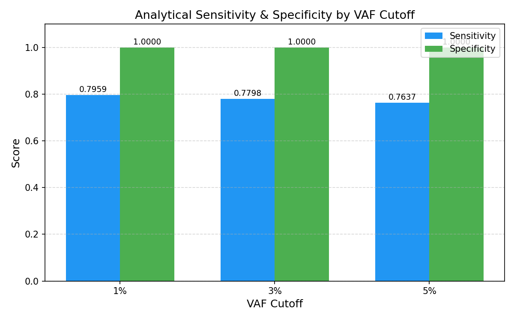
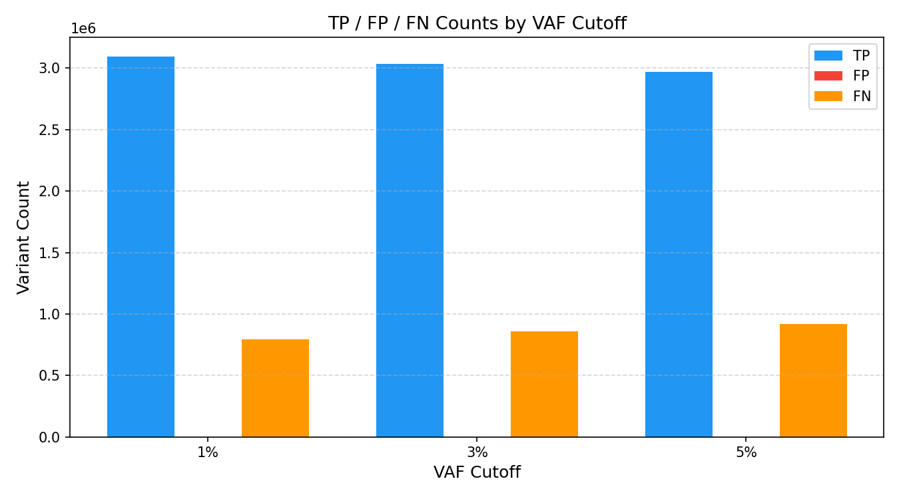

# NGS Sensitivity Benchmark Pipeline

A reusable, end-to-end pipeline for calculating **analytical sensitivity and specificity** of NGS variant calling assays at multiple VAF (Variant Allele Frequency) cutoffs.

Built using GIAB (Genome in a Bottle) gold-standard reference data.

---

## What This Pipeline Does

1. Downloads GIAB truth VCF and high-confidence BED regions
2. Filters truth variants to high-confidence regions only
3. Simulates an imperfect NGS assay (80% TP, 20% FN) from the truth VCF
4. Calculates TP, FP, FN → Sensitivity & Specificity at 1%, 3%, and 5% VAF cutoffs
5. Generates publication-style figures

---

## Results

| VAF Cutoff | TP | FP | FN | Sensitivity | Specificity |
|---|---|---|---|---|---|
| 1% | 3,096,605 | 0 | 793,991 | 0.7959 | 1.0 |
| 3% | 3,033,979 | 0 | 856,617 | 0.7798 | 1.0 |
| 5% | 2,971,417 | 0 | 919,179 | 0.7637 | 1.0 |

### Sensitivity & Specificity by VAF Cutoff


### TP / FP / FN Counts by VAF Cutoff


---

## Requirements

- Linux / WSL
- Conda

## Setup

```bash
git clone https://github.com/fatimasyed10/NGS-Sensitivity-Benchmark.git
cd NGS-Sensitivity-Benchmark
conda env create -f environment.yml
conda activate ngs_study
pip install matplotlib pillow cyvcf2 pandas
```

## Usage

Run scripts in order:

```bash
# 1. Download GIAB data
mkdir -p data/raw data/processed results
wget https://ftp-trace.ncbi.nlm.nih.gov/giab/ftp/release/AshkenazimTrio/HG002_NA24385_son/latest/GRCh38/HG002_GRCh38_1_22_v4.2.1_benchmark.vcf.gz -P data/raw/
wget https://ftp-trace.ncbi.nlm.nih.gov/giab/ftp/release/AshkenazimTrio/HG002_NA24385_son/latest/GRCh38/HG002_GRCh38_1_22_v4.2.1_benchmark.vcf.gz.tbi -P data/raw/
wget https://ftp-trace.ncbi.nlm.nih.gov/giab/ftp/release/AshkenazimTrio/HG002_NA24385_son/latest/GRCh38/HG002_GRCh38_1_22_v4.2.1_benchmark_noinconsistent.bed -P data/raw/

# 2. Filter to high-confidence regions
bcftools view \
  -R data/raw/HG002_GRCh38_1_22_v4.2.1_benchmark_noinconsistent.bed \
  data/raw/HG002_GRCh38_1_22_v4.2.1_benchmark.vcf.gz \
  -Oz -o data/processed/HG002.truth.filtered.vcf.gz
bcftools index data/processed/HG002.truth.filtered.vcf.gz

# 3. Simulate assay
python scripts/03_simulate_assay.py

# 4. Run benchmarking
python scripts/04_benchmark.py

# 5. Generate figures
python scripts/05_figures.py
```

---

## Project Structure
ngs-sensitivity-benchmark/
├── README.md
├── environment.yml
├── scripts/
│   ├── 03_simulate_assay.py
│   ├── 04_benchmark.py
│   └── 05_figures.py
├── results/
│   ├── benchmark_stats.csv
│   ├── figure1_sensitivity_specificity.png
│   └── figure2_variant_counts.png
└── .gitignore

---

## Notes

- Specificity is 1.0 because the simulated assay contains no false positives — in a real assay, sequencing artifacts would introduce FPs and lower specificity
- Sensitivity decreases at higher VAF cutoffs as expected — stricter filtering removes more low-frequency calls
- Replace the simulated assay VCF with a real caller output to benchmark actual assay performance

---

*by Fatima Roshan [GitHub](https://github.com/fatimasyed10)*
